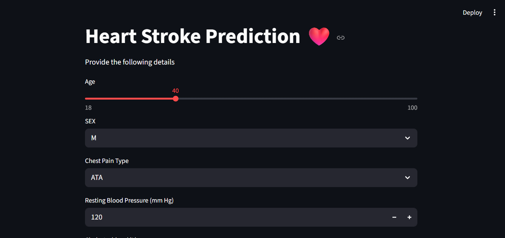
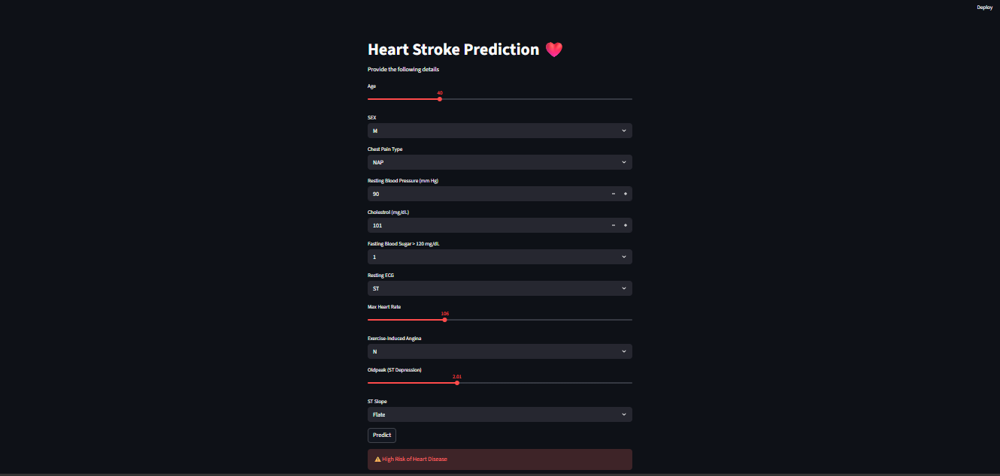
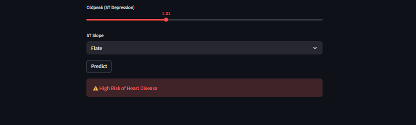

# ❤️ Heart Disease Prediction

## 📌 Project Overview
This is a Machine Learning project that predicts whether a patient is likely to have heart disease based on medical parameters.

## 🚀 Features
- Heart Disease Prediction
- Machine Learning Model
- Streamlit Web App
- User-friendly Interface

## 🛠 Technologies Used
- Python
- Pandas
- NumPy
- Scikit-learn
- Streamlit
- Jupyter Notebook

## 📂 Project Structure

Heart-Disease-Prediction/
│── app.py
│── heart.csv
│── KNN_heart.pkl
│── heart_scaler.pkl
│── heart_columns.pkl
│── requirements.txt
│── README.md

##  Project Screenshots

### 🏠 Home Page

### 📥 Input Page

### 📊 Prediction Result

## ▶️ How to Run

pip install -r requirements.txt
streamlit run app.p

## 📊 Dataset
heart.csv

## 👨‍💻 Author
Arun Gupta

## 🚀 Live Demo

**🔗 Click here to use the application**
https://heart-disease-prediction-6ncwnuykcml8vcgcjpg7dm.streamlit.app
